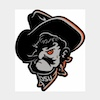

# azure-cdn-demo

Demo repo that will create a CDN to store static assets from a private blob storage account. I followed [this](https://learn.microsoft.com/en-us/azure/frontdoor/integrate-storage-account) document to get this created.

## Prerequisits

- An Azure subscription
- Azure Developer CLI `AZD`
  - [Install azd](https://learn.microsoft.com/en-us/azure/developer/azure-developer-cli/install-azd?tabs=winget-windows%2Cbrew-mac%2Cscript-linux&pivots=os-windows)

## How to use this repo

By following the steps below you will have a CDN and storage account created in your subscription with 2 files that you can view `pete.jpg` and `wilson.jpg`.  The storage account will have no public network access and the CDN will be connecting to it via a private endpoint so you can get to these assets from a browser once you have created a SAS token.

- Fork or clone this repo
- Run `azd up`
  - This will prompt you for a few things like the subscription and the location where you want to create the resources. It will then ask you what you want to call the resource group.
- That should be it!

## How to test

Now that you have all the infrastructure in place, you can confirm it works by going to the endpoint that is returned in the `azd up` command and add either of the following images to the url (along with a [SAS token](https://learn.microsoft.com/en-us/azure/ai-services/document-intelligence/authentication/create-sas-tokens?view=doc-intel-4.0.0)). When put in your browser it should render the images below:

- `static-assets/pete.jpg`
  
- `static-assets/wilson.jpg`
  
